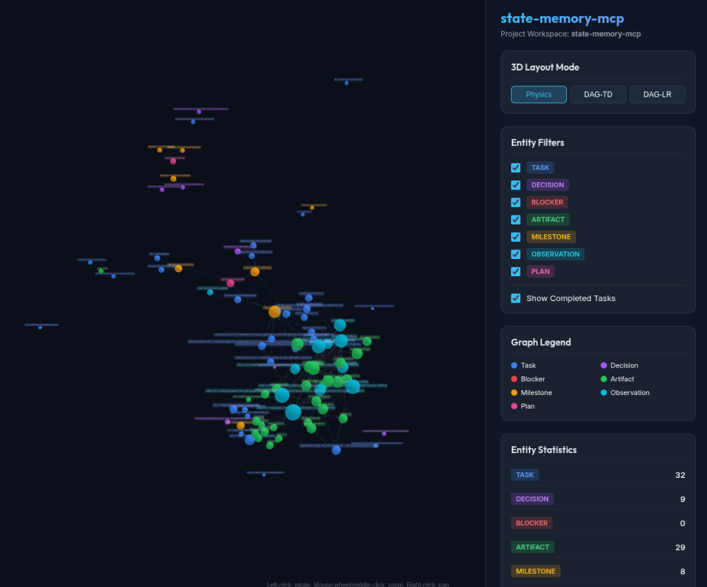

# @putervision/state-memory-mcp

[](https://www.npmjs.com/package/@putervision/state-memory-mcp)
[](https://statememorymcp.com)
[](https://github.com/putervision/state-memory-mcp/blob/main/LICENSE)

`@putervision/state-memory-mcp` is a zero-infrastructure, deterministic Model Context Protocol (MCP) server that provides AI agents with a structured, persistent graph for tracking workflow state—tasks, decisions, artifacts, plans, blockers, and their semantic relationships. Official Documentation & Interactive Demos: [statememorymcp.com](https://statememorymcp.com)

By using `@putervision/state-memory-mcp`, your AI coding assistant (such as Cursor, Claude Code, Gemini, or Copilot) maintains long-term project coherence, manages complex dependencies, and audits architectural decisions across sessions.

---

## ⚡ Quick Start & Installation

> **Prerequisites**: Node.js **>= 20.0.0**

```bash
# Install globally
npm install -g @putervision/state-memory-mcp

# Navigate to your project directory
cd your-project

# Initialize — creates .state-memory-mcp/, updates .gitignore,
# registers project in ~/.state-memory-mcp/projects.json, and
# scaffolds IDE instructions and MCP configs for Cursor, Claude, Windsurf, etc.
state-memory-mcp init

# Single-command global init — re-initializes across all registered projects
state-memory-mcp init-global

# Done! Restart your IDE or Agent Manager (Cursor, VS Code, Antigravity, Claude) to activate.
```

### Alternative Installation Options

```bash
# Run directly via binary (after global install)
state-memory-mcp run

# Or install as a project dev dependency
npm install --save-dev @putervision/state-memory-mcp
```

---

## Key Features

1. **Deterministic State Memory**: No LLM in the loop; all operations are structured, deterministic, and fast.
2. **SQLite Storage**: Zero-infrastructure database persisted project-locally (under `.state-memory-mcp/`) or globally.
3. **81 Core MCP Tools**: Covers Node CRUD, relationship linking, circular dependency rejection, full-text search (FTS5), dependency path tracing, blocker analysis, semantic blocker RAG search (`find_similar_blockers`), automated staleness pruning (`auto_prune_stale_tasks`), natural language text-to-graph querying (`natural_language_query`), multi-agent optimistic CAS concurrency & blackboard store (`post_blackboard`, `read_blackboard`), atomic compound feature decomposition (`plan_and_decompose_feature`, `post_mortem_from_session`), time-travel history recovery (`get_state_at_timestamp`, `revert_to_timestamp`), cross-memory validation & auto-healing (`validate_memory_references`), velocity & burndown time-series analytics (`velocity_analytics`, `burndown_chart`), bidirectional issue sync (`export_issues`, `import_issues`), VCS branch sync & merge resolution (`vcs_branch_sync`, `vcs_merge_resolution`), automated compaction & historical archiving (`compact_graph`, `archive_completed_nodes`), health doctor & watcher (`doctor_report`, `watch_graph_changes`), value analytics, database administration utilities, template scaffolding, agent QoL context tools, session lifecycle tracking, event logging, cryptographic SHA-256 session audit verification (`verify_audit_chain`), state rollback/undo, compound workflow tools (`bootstrap_session`, `complete_task`, `batch_create_nodes`, `batch_add_edges`), selective field projections (`fields`), self-healing graph repair (`auto_fix`), dynamic resources, and workflow prompts.
4. **Interactive 3D HTML Visualizer**: Easily export or view your project state graph in your browser using an interactive, dark-themed WebGL 3D Force-Directed Graph visualizer built with `3d-force-graph` / Three.js.
5. **Safe SQL Querying**: Safe read-only SELECT querying against the database for advanced analytics.
6. **Git Branch Awareness**: Dynamically tracks and filters states based on the checkout workspace Git branch.
7. **One-Command Setup**: `state-memory-mcp init` scaffolds the data directory, `.gitignore`, IDE instruction files, and MCP configs for all major editors.
8. **Event-Sourced Audit Trail**: Every node and edge mutation is logged to an append-only events table with before/after state snapshots, session attribution, and timestamps.
9. **Session & Agent Tracking**: First-class session lifecycle with agent identity, enabling multi-agent collaboration and full provenance of who changed what.
10. **Persistent Context Snapshots**: Save, list, and diff context snapshots across sessions to detect drift and answer "what changed since last time?"
11. **Dual MCP Synergy**: Deep integration with `vision-memory-mcp` for unified text+visual trajectory tracking, automatic visual cache grounding, and visual state verification for UI tasks.

---

## Why State Memory MCP? (Agent Value Proposition)

AI coding agents (like Cursor, Gemini, Claude, and Copilot) operate within strict context window and performance limits. Storing your project's workflow state in the chat history or forcing agents to search files repeatedly is inefficient. `state-memory-mcp` solves this by introducing a structured, external state engine:

* **🧠 Cognitive Externalization**: Grounded in Cognitive Load Theory, this offloads the agent's extraneous load ($CL_E$). By relocating state from the model's weights and active context window into SQLite, it converts complex recall tasks into simple recognition tasks. Only the active node's schema and target variables are paged into context, preserving attention budget.
* **🚀 Faster Agent Executions**: Instead of running expensive, multi-step text search loops or file scans to figure out what to do next, agents can query `get_project_summary` or `find_blockers` in milliseconds. They immediately understand current blockers, goals, and outstanding tasks, reducing end-to-end execution latency by **67% to 74%** in multi-agent workflows.
* **📉 Massive Token Savings**: Storing logs, decisions, and task statuses in chat prompts wastes tokens on every turn. With `state-memory-mcp`, agents keep this state offloaded in a local SQLite database, fetching only relevant subgraphs when needed. This reduces context bloat and API costs by **128× to 462×** when utilizing compiled trajectory models.
* **🎯 Increased Quality of Responses**: Hallucinations and duplicate work happen when agents forget past context. A branch-aware state graph provides agents with a single, clear source of truth for all architectural decisions, milestones, and task requirements. Agents write better code because they always know *why* a decision was made.
* **🔒 First-Hop Determinism**: Unlike probabilistic vector RAG (cosine similarity), `state-memory-mcp` graph queries use deterministic SQL/CTE traversals. This eliminates the "first-hop" retrieval error that propagates cascading hallucinations down multi-agent execution pipelines.
* **🔗 Simplified Relationship Modeling**: Relationships are explicitly mapped with typed links (e.g. `blocks`, `produces`, `depends_on`). The server automatically validates dependencies and rejects circular reference loops, maintaining a clean, easily-navigable project structure.
* **🤝 Supercharged Multi-Agent Collaboration**: When deploying parallel subagents (e.g., one writing code, one running tests, one scanning logs), they lack a shared memory pool. `state-memory-mcp` acts as a local blackboard (Shared Context Store) where all subagents publish decisions, tasks, and blocker updates, ensuring coordination-level alignment without passing massive chat histories. This limits central LLM invocations to a constant $O(1)$ (Plan + Summarize) instead of scaling linearly $O(N)$ with task steps.
* **📈 Compounding Memory Flywheel**: As you log more tasks, architectural decisions, and observations, the state memory transitions from a simple checklist into a rich repository of project intelligence. Future agents can trace the `decision_trail`, reuse established subgraphs, avoid repeating past failures (recorded as blockers/observations), and instantly query context snapshots to understand code rationale. The more context is recorded, the less onboarding/discovery overhead is required for new agents, creating a compounding productivity flywheel.

> *\*Disclaimer: Latency reduction percentages and token savings ratios cited above are illustrative metrics derived from controlled context-store research models. Actual performance improvements, token savings, and cost reductions vary depending on model provider choice, prompt frequency, and individual workflow complexity.*

---

## State Memory Concepts

`state-memory-mcp` models your development workspace as a directed acyclic graph (DAG) where nodes represent development objects and edges represent their semantic relationships.

### 📋 Node Types & Valid Status Values

1. **`task`**: Incremental items of work or coding TODOs (Status: `pending`, `in_progress`, `done`, `blocked`, `cancelled`).
2. **`decision`**: Architectural choices, pattern selections, and rationale (Status: `active`, `accepted`, `deprecated`, `rejected`).
3. **`artifact`**: Coding output, documentation, or schemas generated (Status: `current`, `draft`, `deprecated`).
4. **`plan`**: High-level development specifications and roadmaps containing milestones (Status: `active`, `draft`, `completed`, `archived`).
5. **`milestone`**: Progress checkpoints representing a grouped set of related tasks (Status: `upcoming`, `in_progress`, `done`, `delayed`).
6. **`blocker`**: Impediments or bugs preventing tasks from being completed (Status: `active`, `resolved`, `mitigated`).
7. **`observation`**: Contextual findings, codebase notes, or runtime constraints recorded by the agent (Status: `active`, `archived`).
8. **`visual_state`**: Represents a visual UI screenshot checkpoint via Dual MCP Synergy (Status: `active`, `archived`, `invalidated`).

### 🔗 Edge Relationships

Nodes are linked together to represent workflow connections:
* `depends_on`: Declares that a task or milestone depends on another.
* `blocks`: Connects a blocker to the task/milestone it stalls.
* `produces`: Connects a task or milestone to the file artifact it generates.
* `references`: Relates nodes to other source files or documentation.
* `updates` / `contradicts`: Traces the historical chain of decisions or flags conflicting requirements.
* `part_of` / `child_of`: Establishes hierarchical groupings (e.g., tasks belonging to milestones, milestones in plans).
* `implements` / `decided_in`: Links tasks/artifacts to their design decisions or plans.
* `extends` / `modifies`: Git commit trace relationships.
* `renders_state` / `blocked_by_visual_state` / `verifies_visual_state`: Visual memory cross-linking relationships.

*Note: Cycle detection is automatically enforced. If an agent tries to link nodes in a loop (e.g. Task A blocking Task B which depends on Task A), the server immediately rejects the edge creation.*

### 🧠 Advanced Graph Queries

Exposing your state as a graph enables the server to run advanced graph query tools:
* **`critical_path`**: Computes the longest chain of unfinished tasks blocking a milestone so the agent knows what to prioritize.
* **`impact_analysis`**: Calculates the "blast radius" or downstream dependency chain affected if a node (or code file) is edited or deleted.
* **`detect_contradictions`**: Audits the database for logical flaws (e.g. finished tasks that still have active blockers, or contradicting design decisions).
* **`decision_trail`**: Traces the historical lineage of updates and contradictions back to the original architectural choice.
* **`get_event_log` / `get_node_history`**: Query the append-only event ledger and trace exactly when, how, and by whom a node was modified.
* **`undo_last`**: Reverts the last mutation on a node (rollback) to recover from a downstream reasoning or testing failure (FSM State Traceback).

---

## Theoretical Foundations

`state-memory-mcp` is designed to address the key bottlenecks of stateless agentic workflows identified in cognitive science and multi-agent system design:

### 1. Cognitive Externalization (Cognitive Load Theory)
In a stateless agentic loop, packing the context window with conversation histories, full schemas, and system guidelines quickly exceeds the active attention budget, leading to attention diffusion and constraint hallucination. By separating the irreducible complexity of a task (Intrinsic Cognitive Load, $CL_I$) from formatting and presentation clutter (Extraneous Cognitive Load, $CL_E$), `state-memory-mcp` externalizes state. Offloading state into a local SQLite database reduces $CL_E$ and converts a difficult *recall* task into a deterministic *recognition* task.

### 2. Finite State Machine (FSM) Formalism & Boundary Guarantees
In unconstrained environments, language models suffer from greediness and exploration loops. Formalizing transitions using a state-driven graph provides mathematical guarantees of correctness. Key execution rules enabled by this include:
* **State Traceback**: When a downstream validation node identifies an execution failure, it transitions execution back to a preceding node (`undo_last`) rather than trying to recover within a corrupted context window.
* **Bounded execution**: Cycle detection prevents infinite execution loops.
* **Deterministic session replay**: The events ledger enables session replayability for forensics and auditing.

### 3. First-Hop Determinism vs. Probabilistic RAG
Standard vector RAG splits codebases into chunks and retrieves them using probabilistic cosine similarity. If the first hop of context retrieval returns structurally incorrect context, downstream models amplify the error. Grounding the first reasoning step in deterministic graph traversals (using direct nodes and edges) avoids this error propagation entirely.

### 4. Empirical Performance Benchmarks
Empirical studies of stateful context protocol architectures show massive improvements in cost, latency, and reliability:
* **67% to 74% reduction** in end-to-end execution latency by using direct server-to-server state triggers (CA-MCP pattern).
* **Constant $O(1)$ central LLM calls** (Plan + Summarize) instead of $O(N)$ calls scaling with task steps.
* **128× to 462× API cost reduction** by compiling state-transition trajectories from the event log to train smaller, specialized agent models (3B to 8B parameters).

---

## Session & Event Tracking (v0.3.0)

With v0.3.0, `state-memory-mcp` introduces full session management, change logging, and state rollback:

### 📋 Session Lifecycle
Track concurrent agents or sequential tasks using tracked sessions. Starting a session returns a `session_id` that stamps all subsequent graph mutations:
* `start_session`: Start a session with an optional `agent_id` (e.g. `claude-coder`, `gemini-tester`) and custom metadata.
* `end_session`: Conclude the session and log completion.
* `list_sessions`: List active and completed sessions.

### 📜 Event-Sourced Audit Trail
All mutations to nodes and edges are recorded in an append-only `events` ledger. 
* `get_event_log`: Query events in the project with filters.
* `get_node_history`: View every update, creation, or deletion event for a specific node in chronological order.
* `undo_last`: Revert the last recorded change on a node by restoring its `before_state` or deleting a newly created node.

### 💾 Context Snapshots & Diffing
* `save_snapshot`: Save the current graph structure (all nodes and edges) as a named context checkpoint.
* `list_snapshots`: View historical checkpoints.
* `diff_snapshots`: Compare any two checkpoints. Returns exactly which nodes were added, removed, updated, or had their status changed, plus any added/removed edge relationships.

### 📈 Trajectory Export for Model Training
* `export_trajectories`: Export the chronological transition log of a project in JSONL format, providing clean training data to fine-tune smaller local models on standard operating procedures.

### 📂 Sub-Directory & Mono-Repo Support (v0.6.2)
* **Multi-Repo Git Health Accounting**: `state-memory-mcp doctor` discovers and checks root and nested Git repositories across sub-directories up to depth 4, reporting active branches and clean/dirty state.
* **Sub-Directory Memory Observation**: Memory query tools (`list_nodes`, `search_nodes`) and health auditing (`audit`, `audit_project_db`, `doctor`) observe and audit nested `.state-memory-mcp` databases in sub-directories (`include_subdirectories: true`), annotating nodes with sub-project origin tags (`subproject: <slug>`).

### 📑 Spec-Driven Development (SDD) & Ingestion (v0.6.3)
* **Graph-Native Specifications**: Dedicated node types (`spec`, `requirement`, `acceptance_criterion`, `contract`) and SDD edge relationships (`satisfies`, `verifies`, `specifies`, `violates`, `drifts_from`).
* `ingest_spec` / `state-memory-mcp spec:ingest <file>`: Parse and ingest Markdown PRDs, OpenSpec files, or Gherkin (`.feature`) BDD files directly into memory graph nodes.
* `export_spec` / `state-memory-mcp spec:export <specId>`: Export graph-managed specs and child requirements back out to Markdown or Gherkin text.
* `get_spec_compliance` / `state-memory-mcp spec:matrix`: Calculate real-time Spec Compliance matrix and requirement coverage ratio.
* `scaffold_spec`: Scaffold standard feature specification templates in `.specs/`.
* `verify_requirement`: Mark acceptance criteria as verified, failing, or skipped, optionally linking test observations.
* **Git Spec Staleness**: Automatically detects modifications to `.specs/` or `docs/specs/` files in Git commits and flags graph spec nodes as `stale`.

---

## CLI Usage

`state-memory-mcp` comes with a powerful command line interface to manage project databases:

```bash
# Initialize state-memory-mcp in your project (creates .state-memory-mcp/,
# updates .gitignore, scaffolds IDE instructions and MCP configs)
state-memory-mcp init [--no-git] [--commits <n>] [--no-tasks] [--no-artifacts]

# Start the MCP server (used by IDE configs)
state-memory-mcp run

# View the interactive 3D graph visualizer in your default browser
state-memory-mcp view --project my-project

# Inspect project nodes in ASCII format
state-memory-mcp inspect --project my-project

# Display project graph ROI, productivity, and token savings metrics
state-memory-mcp metrics --project my-project

# Export graph data (JSON, DOT, Mermaid, HTML formats supported)
state-memory-mcp export --project my-project --format html --out graph.html
state-memory-mcp export --project my-project --format mermaid

# Import graph data from a JSON file (overwrites existing project data)
state-memory-mcp import data.json --project my-project

# Incrementally scan git history into the graph
state-memory-mcp scan-git --project my-project --commits 30

# Back up the project database to a SQLite file
state-memory-mcp backup --project my-project --out backup.db

# Restore the project database from a SQLite backup file (destructively overwrites)
state-memory-mcp restore backup.db --project my-project

# Audit project and sub-directory databases for integrity, cycles, and contradictions
state-memory-mcp audit --project my-project

# Run environment health checks (Node, SQLite, FTS5, permissions, root & sub-directory git repos, graph integrity)
state-memory-mcp doctor --project my-project

# Update state-memory-mcp globally to the latest version published on npm
state-memory-mcp update

# Merge an external SQLite database into the current project database
state-memory-mcp merge other-project.db --project my-project [--force]
```

---

## Auto-Initialization & IDE Configuration Scaffolding

When starting the server via `state-memory-mcp run` or starting the CLI via `state-memory-mcp init`, the engine executes **Auto-Initialization** (`runAutoInit()`):
1. **Local Storage Setup**: Auto-creates `.state-memory-mcp/` directory, database storage, and `.gitignore` preventing database lock collisions.
2. **IDE Configurations**: Scaffolds or updates MCP client configuration files for:
   - **Google Antigravity**: `~/.gemini/antigravity/mcp/state-memory-mcp/`
   - **Claude Code CLI & Desktop**: `.claude/mcp.json` / `claude_desktop_config.json`
   - **Cursor**: `.cursor/mcp.json`
   - **VS Code**: `.vscode/mcp.json`
   - **Windsurf & Roo Code / Cline**: `.windsurf/mcp.json` / `.cline/mcp.json`
3. **Agent Rules & Skills**: Scaffolds `.agents/AGENTS.md` rules and `.agents/skills/state-memory-mcp/SKILL.md` skill instructions so agents immediately know how to use the server.

---

## MCP Configuration Examples

Running `state-memory-mcp init` automatically creates these configuration files for you. If you prefer to configure manually:

### Cursor (`.cursor/mcp.json`)
```json
{
  "mcpServers": {
    "state-memory-mcp": {
      "command": "state-memory-mcp",
      "args": ["run"],
      "env": {
        "STATE_MEMORY_MCP_PROJECT": "your-project-slug"
      }
    }
  }
}
```

### Google Antigravity IDE (`~/.gemini/antigravity/mcp.json`)
```json
{
  "mcpServers": {
    "state-memory-mcp": {
      "command": "state-memory-mcp",
      "args": ["run"],
      "env": {
        "STATE_MEMORY_MCP_PROJECT": "your-project-slug"
      }
    }
  }
}
```

### VS Code (`.vscode/mcp.json`)
```json
{
  "servers": {
    "state-memory-mcp": {
      "command": "state-memory-mcp",
      "args": ["run"],
      "env": {
        "STATE_MEMORY_MCP_PROJECT": "your-project-slug"
      }
    }
  }
}
```

### Claude Desktop (`claude_desktop_config.json`)
- **macOS**: `~/Library/Application Support/Claude/claude_desktop_config.json`
- **Linux**: `~/.config/Claude/claude_desktop_config.json`
- **Windows**: `%APPDATA%\Claude\claude_desktop_config.json`

```json
{
  "mcpServers": {
    "state-memory-mcp": {
      "command": "state-memory-mcp",
      "args": ["run"],
      "env": {
        "STATE_MEMORY_MCP_PROJECT": "your-project-slug"
      }
    }
  }
}
```

### Google Antigravity (`~/.gemini/antigravity/settings.json`)

For Google Antigravity (AGY), custom MCP servers are configured globally in your `~/.gemini/antigravity/settings.json` (or locally in your workspace `.agents/settings.json`):

```json
{
  "mcpServers": {
    "state-memory-mcp": {
      "command": "state-memory-mcp",
      "args": ["run"],
      "env": {
        "STATE_MEMORY_MCP_PROJECT": "your-project-slug"
      }
    }
  }
}
```

---

## What `init` & `init-global` Set Up

Running `state-memory-mcp init` in your project root will:

1. Create the `.state-memory-mcp/` data directory
2. Add `.state-memory-mcp` to your `.gitignore`
3. Register your workspace in the global index at `~/.state-memory-mcp/projects.json`
4. Create/append IDE instruction files for:
   - **Gemini** (`.gemini/instructions.md`)
   - **Cursor** (`.cursor/rules/state-memory-mcp.mdc`)
   - **GitHub Copilot** (`.github/copilot-instructions.md`)
   - **VS Code** (`.vscode/instructions.md`)
   - **Claude Code** (`CLAUDE.md`)
   - **Windsurf** (`.windsurfrules`)
   - **Antigravity** (`.agents/AGENTS.md` and `.agents/skills/state-memory-mcp/SKILL.md`)
5. Create MCP server configs for Cursor and VS Code with project slug auto-injected.

### Global Multi-Project Synchronization (`init-global`)

Running `state-memory-mcp init-global` re-scaffolds instruction files, rule templates, and agent custom skills across **all projects registered in `~/.state-memory-mcp/projects.json`** in a single turn:

```bash
# Re-initialize all registered projects
state-memory-mcp init-global

# Re-initialize and clean stale registrations for missing directories
state-memory-mcp init-global --clean-stale

# Scan a workspace directory to register and initialize all sub-projects
state-memory-mcp init-global --scan ~/Downloads/working
```

All operations are idempotent — running `init` or `init-global` multiple times is safe.

---

## Git Commit History Scanner

The Git Scanner (`scanGit`) hooks directly into your local git repository to automatically construct a semantic workflow map of your commits:

- **Conventional Commit Parsing**: Commit messages are parsed for conventional type tags (e.g. `feat:`, `fix:`, `docs:`, `refactor:`).
- **Observation Creation**: Every scanned commit generates an `observation` node carrying metadata like commit hash, author email, timestamp, and files modified.
- **Task Seeding**: High-value commits (like those containing active feature work) automatically generate associated `task` nodes linked to the commit observation via an `extends` relationship.
- **Artifact Tracking**: The scanner tracks modified files. If a file is frequently modified (exceeding hotness thresholds), the scanner creates an `artifact` node and links the corresponding commit observation to it using a `modifies` relationship.

---

## Project Seeding Guidelines

For maximum developer-agent alignment, seed your graph immediately after initializing the project:

1. **Add a Plan Node**: Create a high-level `plan` node representing your project roadmap:
   - `add_node(type: "plan", title: "Project Roadmap")`
2. **Define Milestones**: Establish target milestones representing project phases and link them to the plan:
   - `add_node(type: "milestone", title: "v1.0 MVP Release")`
   - `add_edge(source_id: mvp_id, target_id: roadmap_id, type: "part_of")`
3. **Log Core Decisions**: Create `decision` nodes describing architectural components and link them to the milestones:
   - `add_node(type: "decision", title: "SQLite Database Choice", metadata: { "rationale": "Simple, local storage" })`
   - `add_edge(source_id: db_choice_id, target_id: mvp_id, type: "decided_in")`

---

## Environment Variables

| Variable | Description | Default Value |
|---|---|---|
| `STATE_MEMORY_MCP_DIR` | Absolute path to directory where database files are stored. | `.state-memory-mcp/` (Project-local) |
| `STATE_MEMORY_MCP_PROJECT` | Active project slug identifier override. | Auto-resolved from project directory |
| `STATE_MEMORY_MCP_LOG_LEVEL` | Logging verbosity on `stderr` (`debug`, `info`, `warn`, `error`). | `info` |
| `STATE_MEMORY_MCP_DEFAULT_BRANCH` | Fallback branch name if Git cannot be queried on startup. | `main` |
| `STATE_MEMORY_ENCRYPTION_KEY` | Hex or string key for AES-256-GCM metadata payload encryption at rest. | `undefined` (plaintext) |
| `STATE_MEMORY_MAX_DB_BYTES` | Maximum database size safety limit in bytes before rejecting writes. | `5368709120` (5 GB) |
| `STATE_MEMORY_BUSY_TIMEOUT` | SQLite database lock busy timeout in milliseconds. | `5000` (5 seconds) |
| `STATE_MEMORY_WAL_MODE` | SQLite journal mode (`WAL`, `DELETE`, `TRUNCATE`, `PERSIST`, `MEMORY`, `OFF`). | `WAL` |
| `STATE_MEMORY_CYCLE_DETECTION_MODE` | Graph cycle detection policy (`strict` or `best_effort`). | `strict` |
| `STATE_MEMORY_READ_ONLY` | Forces server into read-only access mode (`true`/`false`). | `false` |
| `STATE_MEMORY_AUDIT_ONLY` | Forces server into audit-only access mode (`true`/`false`). | `false` |
| `STATE_MEMORY_ADMIN_KEY` | Secret token required to execute administrative operations like `prune_events`. | `undefined` |
| `STATE_MEMORY_ADMIN_MODE` | Enables administrative mode globally (`true`/`false`). | `false` |
| `STATE_MEMORY_STRICT_AUDIT` | Enforces strict cryptographic event log verification. | `false` |
| `STATE_MEMORY_WEBHOOK_URL` | Webhook HTTP POST endpoint for real-time state change notifications. | `undefined` |
| `STATE_MEMORY_WEBHOOK_SECRET` | Secret token sent as `Authorization: Bearer <secret>` in webhook headers. | `undefined` |
| `STATE_MEMORY_WEBHOOK_TIMEOUT` | Webhook HTTP POST timeout in milliseconds. | `5000` (5 seconds) |
| `STATE_MEMORY_ALLOW_PRIVATE_WEBHOOKS` | Allows dispatching webhooks to local/private network IP addresses. | `false` |
| `ALLOW_PRIVATE_WEBHOOKS` | Alias flag for private network webhook dispatch approval. | `false` |

---

## Tool Reference (81 Tools)

### 🚀 High-Level Compound Workflow Tools (4 Tools)
* **`bootstrap_session`**: Single-turn session initialization combining session tracking (`start_session`), context snapshot generation, and top unblocked tasks retrieval.
  * Inputs: `project`, `agent_id`, `metadata`, `task_limit`.
* **`complete_task`**: Single-turn task completion that updates task status to `'done'`, optionally creates a produced `'artifact'` node, and links them via a `'produces'` relationship.
  * Inputs: `task_id`, `artifact_title`, `artifact_metadata`, `tags`, `project`.
* **`batch_create_nodes`**: Atomically creates multiple nodes in a single transaction with SQLite FTS5 search index synchronization.
  * Inputs: `nodes`, `project`.
* **`batch_add_edges`**: Atomically creates multiple edge relationships with DAG cycle checks (`hasCycle`) and transaction rollback on failure.
  * Inputs: `edges`, `project`.

### 🟢 Node & Relationship Management (6 Tools)
* **`add_node`**: Creates a node (`task`, `decision`, `artifact`, `plan`, `observation`, `blocker`, `milestone`).
  * Inputs: `type`, `title`, `project`, `status`, `metadata`, `tags`.
* **`update_node`**: Modifies properties (title, status, metadata, tags) of an existing node.
  * Inputs: `id`, `project`, `title`, `status`, `metadata`, `tags`.
* **`get_node`**: Fetches a node's details and all inbound/outbound relationships.
  * Inputs: `id`, `project`, `include_edges`.
* **`remove_node`**: Deletes a node and automatically cascades deletions to all connected edges.
  * Inputs: `id`, `project`.
* **`add_edge`**: Links two nodes with a typed relationship (`depends_on`, `blocks`, `produces`, `references`, `decided_in`, `updates`, `contradicts`, `part_of`, `implements`, `child_of`, `extends`, `modifies`, `renders_state`). Cycles are rejected for directed dependency types.
  * Inputs: `source_id`, `target_id`, `type`, `project`, `properties`.
* **`remove_edge`**: Deletes a specific relationship between two nodes.
  * Inputs: `source_id`, `target_id`, `type`, `project`.

### 🔍 Search & Querying (4 Tools)
* **`list_nodes`**: Returns lists of nodes matching filters with support for selective field projection (`fields`), compact mode, pagination, tags, and branch tracking.
  * Inputs: `type`, `status`, `tags`, `project`, `limit`, `offset`, `compact`, `git_branch`, `fields`, `pretty_print`.
* **`search_nodes`**: Performs fast full-text search (FTS5) or TF-IDF cosine similarity search across title, metadata, and tags with field projection (`fields`).
  * Inputs: `query`, `type`, `status`, `limit`, `algorithm`, `fields`, `pretty_print`, `project`.
* **`get_subgraph`**: Extracts a node and its N-hop neighbor nodes and connecting relationships with field projection (`fields`).
  * Inputs: `root_id`, `depth`, `edge_types`, `node_types`, `fields`, `pretty_print`, `project`.
* **`query_graph`**: Executes safe, read-only SELECT SQL queries against the underlying database. Sanitized to block dangerous SQLite functions.
  * Inputs: `sql`, `params`, `project`.

### 🧠 Advanced Analytics & Tracing (8 Tools)
* **`trace_dependencies`**: Computes recursive upstream (requirements) or downstream (dependents) dependency chains.
  * Inputs: `node_id`, `direction`, `edge_types`, `max_depth`, `project`.
* **`find_blockers`**: Lists active blocker nodes and the tasks/milestones they block.
  * Inputs: `node_id`, `include_transitive`, `project`.
* **`get_project_summary`**: Provides a high-level project summary containing node breakdowns, task completion progress, recent decisions, and active blockers.
  * Inputs: `project`.
* **`decision_trail`**: Traces the historical chain of decisions that led to a given state (updates/contradicts).
  * Inputs: `node_id`, `project`.
* **`critical_path`**: Computes the longest chain of uncompleted tasks leading to a milestone (minimum set of tasks that must finish).
  * Inputs: `milestone_id`, `project`.
* **`impact_analysis`**: Calculates the downstream blast radius if a node is modified or deleted.
  * Inputs: `node_id`, `project`.
* **`detect_contradictions`**: Scans the project for logical flaws (e.g. completed tasks that still have active blockers, contradicting accepted decisions).
  * Inputs: `project`.
* **`value_metrics`**: Computes estimated time and token savings, graph density, orphan count, decision reuse rate, task velocity, and active blocker ages. Returns both structured JSON and a formatted Markdown report.
  * Inputs: `project`.

### 🤖 Agent QoL & Templates (4 Tools)
* **`get_context_snapshot`**: Dual-format context snapshot returning structured JSON data (blockers, pending tasks) and pre-rendered Markdown for quick agent prompting.
  * Inputs: `project`.
* **`find_related_decisions`**: Finds all decisions that affected a given artifact node (directly or via milestones).
  * Inputs: `artifact_id`, `project`.
* **`find_blocked_tasks`**: Finds all tasks blocked directly or transitively by a decision node.
  * Inputs: `decision_id`, `project`.
* **`scaffold_template`**: Automates scaffolding of standard development workflows. Supported templates: `fdd` (Feature-Driven Development design/build milestones & tasks) and `rfc` (Request for Comments author/review/decision loop).
  * Inputs: `template`, `name`, `project`.

### 🛡️ Administration & Backups (6 Tools)
* **`export_graph`**: Exports project graph to JSON, DOT, Mermaid flowchart, or interactive HTML formats.
  * Inputs: `format`, `project`.
* **`import_graph`**: Bulk loads nodes and edges from external files.
  * Inputs: `nodes`, `edges`, `project`.
* **`backup_project_db`**: Creates an online SQLite database backup file along with an integrity SHA-256 checksum file.
  * Inputs: `outputPath`, `project`.
* **`restore_project_db`**: Restores the database from a backup file, checking the structural SQLite integrity and matching the SHA-256 checksum file.
  * Inputs: `backupPath`, `project`.
* **`audit_project_db`**: Audits database structure, foreign key constraints, orphaned edges, cycles, and logical contradictions.
  * Inputs: `project`.
* **`merge_project_db`**: Safely merges two project databases, keeping the newer node (based on `updated_at`) and validating circular dependencies.
  * Inputs: `sourcePath`, `force`, `project`.

### ⏱️ Event Sourcing & Trajectories (9 Tools)
* **`start_session`**: Starts a tracking session for mutations.
  * Inputs: `agent_id`, `project`, `metadata`.
* **`end_session`**: Concludes an active session.
  * Inputs: `session_id`, `project`.
* **`get_event_log`**: Retrieves mutation event logs.
  * Inputs: `session_id`, `entity_id`, `event_type`, `since`, `until`, `limit`, `offset`, `project`.
* **`get_node_history`**: Fetches modification history for a specific node.
  * Inputs: `node_id`, `project`.
* **`undo_last`**: Undoes the last mutation event on a specific node.
  * Inputs: `node_id`, `project`.
* **`save_snapshot`**: Saves a full static graph snapshot.
  * Inputs: `session_id`, `project`.
* **`list_snapshots`**: Lists saved snapshots.
  * Inputs: `limit`, `project`.
* **`diff_snapshots`**: Computes changes (added, removed, status/property changes) between two snapshots.
  * Inputs: `snapshot_id_a`, `snapshot_id_b`, `project`.
* **`export_trajectories`**: Exports trajectories in JSONL format for agent training.
  * Inputs: `session_id`, `since`, `until`, `limit`, `offset`, `project`.

### ⚡ Batch & Staleness Utilities (8 Tools)
* **`batch_update`**: Executes atomic batch node updates (status, metadata, tags).
  * Inputs: `ids`, `status`, `metadata`, `tags`, `project`.
* **`next_tasks`**: Suggests next runnable tasks based on priority, blocker status, branch, and field projection (`fields`).
  * Inputs: `git_branch`, `limit`, `include_context`, `fields`, `pretty_print`, `project`.
* **`what_changed`**: Reports graph changeset diffs since a session start or timestamp.
  * Inputs: `since`, `since_session`, `git_branch`, `project`.
* **`get_stale_nodes`**: Identifies nodes that have been inactive/untouched for longer than a given threshold.
  * Inputs: `older_than`, `status`, `type`, `git_branch`, `limit`, `project`.
* **`validate_graph`**: Validates the graph for structural anomalies with self-healing auto-fix option (`auto_fix: true`).
  * Inputs: `checks`, `auto_fix`, `project`.
* **`prune_events`**: Prunes event logs older than a threshold while preserving entity states.
  * Inputs: `older_than`, `dry_run`, `preserve_types`, `project`.
* **`add_note`**: Atomically creates an observation note and references an existing node.
  * Inputs: `text`, `attach_to`, `tags`, `project`.

---

## MCP Resources & Prompts

`state-memory-mcp` is fully compliant with the latest Model Context Protocol specification, exposing read-only data resources, dynamic URI templates, and reusable prompt templates to client applications.

### 📁 Resources & Templates

Resources provide direct read-only context to LLMs. `state-memory-mcp` registers the following resources under the `state-memory:///` URI scheme:

* **`state-memory:///{project}/summary`**: Returns the structured project summary (counts, task progress, recent decisions).
* **`state-memory:///{project}/blockers`**: Returns the list of all active blockers and their affected nodes.
* **`state-memory:///{project}/tasks/next`**: Returns top unblocked runnable tasks.
* **`state-memory:///{project}/node/{id}`**: Returns individual node details and connected relationships.
* **`state-memory:///{project}/metrics`**: Returns project velocity and value creation metrics.
* **`state-memory:///{project}/decisions`**: Returns the log of recent accepted decisions.
* **`state-memory:///{project}/graph.json`**: Returns a full node/edge database export as raw JSON.

### 💬 Prompts

Prompts are reusable workflow templates that streamline agent interactions:

* **`session-start`**: Generates a startup workspace overview, outlining the project summary, active blockers, and immediate pending tasks.
  * Arguments: `project` (optional).
* **`handover-summary`**: Generates context summary for agent-to-agent session handoffs and recent event logs.
  * Arguments: `project` (optional).
* **`task-decomposition`**: Guides model through decomposing a milestone into a task DAG with dependency links.
  * Arguments: `milestone_title` (required), `project` (optional).
* **`post-mortem`**: Prompts post-mortem analysis of stale/cancelled tasks and decision record updates.
  * Arguments: `project` (optional).
* **`plan-feature`**: Prompts the agent to plan out a new feature, guiding milestone creation, task decomposition, dependency mapping, and design decisions.
  * Arguments: `feature_name` (required), `project` (optional).
* **`review-decisions`**: Prompts the agent to review the decision log and logical contradictions audit, recommending improvements or fixes.
  * Arguments: `project` (optional).
* **`triage-blockers`**: Triages active blockers, helping to analyze the critical path and devise mitigation strategies.
  * Arguments: `project` (optional).


---

## Interactive 3D HTML Visualizer

`state-memory-mcp` offers an interactive, dark-mode browser 3D visualization using WebGL/Three.js to explore your project's workflow state graph.



### Viewing the Visualizer
To generate and view the visualizer instantly in your default web browser, run:
```bash
state-memory-mcp view --project my-project
```
This command:
1. Generates a standalone `viewer.html` containing the embedded graph dataset.
2. Saves it in the project database folder.
3. Automatically launches the page in your default browser.

### Exporting the Visualizer
To export the visualizer to a specific file:
```bash
state-memory-mcp export --project my-project --format html --out ./my-graph.html
```
You can share the exported HTML file with your team. The file contains a responsive 3D Force-Directed network graph rendering with:
- Interactive zoom, pan, and 360-degree rotation.
- Hover details for nodes and relationships.
- Distinct color-coded nodes based on types.
- Automatic force layouts.

---

## Upgrading to v0.3.0

The database schema migrations run **automatically** on first run after upgrading the package. No manual steps are required, and existing node and edge data is preserved.
* Note: The new events ledger starts logging mutations from the moment of the upgrade; historical mutations that occurred prior to v0.3.0 are not backfilled.

---

## Testing

```bash
# Run unit and integration tests
npm run test
```

## License & Author

Developed and maintained by [PuterVision LLC](https://putervision.com). Released under the [MIT License](LICENSE).

### Limitation of Liability

THE SOFTWARE IS PROVIDED "AS IS", WITHOUT WARRANTY OF ANY KIND, EXPRESS OR IMPLIED, INCLUDING BUT NOT LIMITED TO THE WARRANTIES OF MERCHANTABILITY, FITNESS FOR A PARTICULAR PURPOSE AND NONINFRINGEMENT. IN NO EVENT SHALL THE AUTHORS OR COPYRIGHT HOLDERS BE LIABLE FOR ANY CLAIM, DAMAGES OR OTHER LIABILITY, WHETHER IN AN ACTION OF CONTRACT, TORT OR OTHERWISE, ARISING FROM, OUT OF OR IN CONNECTION WITH THE SOFTWARE OR THE USE OR OTHER DEALINGS IN THE SOFTWARE.

By using this software, you acknowledge and agree that the authors and contributors are not liable for any database corruption, Git repository modification, data loss, or other issues resulting from execution. Always backup your database files before performing destructive operations.

### Trademarks & Non-Affiliation Notice

All product names, trademarks, service marks, logos, and brands (such as Cursor, Claude Code, OpenAI, Gemini, Windsurf, GitHub, and SQLite) referenced in this project and documentation are the property of their respective owners. References to third-party products, services, or companies are strictly for compatibility identification and descriptive purposes only, and do not constitute or imply endorsement, sponsorship, or affiliation with PuterVision LLC.

---

## ⚖️ PuterVision Legal & Usage Disclaimers

> [!IMPORTANT]
> **Data Privacy & Local Storage Guarantee**  
> `state-memory-mcp` is designed and built by PuterVision LLC with a strict **local-first privacy architecture**. All task DAGs, decision records, session event logs, and visual state embeddings are stored 100% locally in your workspace's `.state-memory-mcp/state.db` SQLite database. No project data, code snippets, or workflow logs are ever transmitted, telemetry-tracked, or collected by PuterVision LLC.

> [!WARNING]
> **Third-Party AI Model & API Fees Disclaimer**  
> `state-memory-mcp` is an open-source Model Context Protocol (MCP) server released under the MIT License. It interfaces with third-party LLM providers and coding clients (including Anthropic Claude, OpenAI GPT-4o, xAI Grok, Google Gemini, and Ollama). Using AI coding clients may incur API token usage fees billed directly by those respective providers. PuterVision LLC is not responsible for third-party API charges incurred while executing MCP agent sessions.

> [!NOTE]
> **Performance & ROI Estimates**  
> Token savings ratios (up to 462×), execution latency reductions (up to 74%), and agent performance benchmarks cited in documentation are derived from controlled multi-turn software development benchmarks. Actual performance gains and token savings will vary depending on workspace size, LLM provider model choice, prompt frequency, and individual workflow complexity.