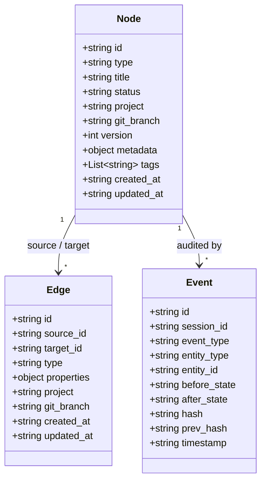
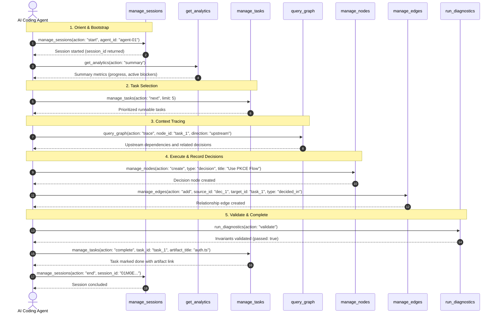

# Codebase Distillation: `@putervision/state-memory-mcp`

> **Document Purpose**: This document provides a high-signal architectural distillation of the `@putervision/state-memory-mcp` codebase. It extracts the essential structure, design decisions, component interactions, and key execution flows while discarding boilerplate and trivial implementation details.

---

## 1. High-Level Overview

### Primary Purpose
`@putervision/state-memory-mcp` is a zero-infrastructure, deterministic Model Context Protocol (MCP) server that provides AI coding agents (such as Cursor, Claude Code, Gemini Antigravity, Windsurf, and VS Code Copilot) with a persistent, structured SQLite graph for tracking workflow state:
- **Tasks & Work Queue**: Topological dependency ordering, blocker detection, and automated task prioritization.
- **Architectural Decisions (ADRs/RFCs)**: Context preservation across agent sessions and turns.
- **Spec-Driven Development (SDD)**: PRD/RFC/FDD parsing, requirement decomposition, and live compliance verification.
- **Event-Sourced Audit Trail**: Append-only cryptographic SHA-256 hash chaining for tamper-evident history.
- **Multi-Agent Coordination**: Asynchronous blackboard message passing with TTL expiration.

By offloading workflow state to an indexed local database, it eliminates repetitive file re-scanning loops, prevents context window bloat, and preserves critical architectural decisions across long-running or multi-agent sessions.

### Tech Stack & Core Technologies
| Category | Technology | Role & Rationale |
| :--- | :--- | :--- |
| **Runtime** | Node.js (ESM, `>=18.18.0`) | Modern asynchronous runtime with native ESM support. |
| **Language** | TypeScript (`^5.5.2`) | Strict static typing across schemas, engines, and protocols. |
| **Protocol** | `@modelcontextprotocol/sdk` (`^1.0.4`) | Standard JSON-RPC 2.0 transport over `stdio`, MCP resources, and prompts. |
| **Database** | `better-sqlite3` (`^11.0.0`) | Embedded, synchronous SQLite engine with WAL mode and native FTS5 full-text indexing. |
| **Validation** | `zod` (`^3.23.8`) | Runtime schema validation and dynamic JSON Schema compilation for MCP tool calls. |
| **CLI & Tools** | `commander` | CLI interface for repository auto-initialization, health checks, and database management. |
| **Build & Test** | `tsup`, `vitest` (`^4.1.10`) | Zero-config TypeScript bundling and high-speed unit/integration test runner. |

### Architecture Style
The system employs a **Layered Clean Architecture** combined with **Event Sourcing** and **Finite State Machine (FSM)** semantics:
- **Zero-LLM Determinism**: All internal operations (graph traversal, topological sorting, cycle detection, TF-IDF ranking, SQL execution) are 100% deterministic, executing in `<2ms` with zero token overhead.
- **Local-First Data Sovereignty**: All state resides locally in `.state-memory-mcp/` (or global user fallback `~/.state-memory-mcp/`), with strict OS file permissions (`0o700` directories, `0o600` database files).

```mermaid
graph TD
    Client["AI Agent / MCP Client (Cursor, Claude, Gemini, Windsurf)"]
    Stdio["StdioServerTransport (JSON-RPC 2.0)"]
    McpServer["McpServer Registry (src/server.ts)"]
    Router["Tool Dispatcher & Zod Validator (src/tools/handlers.ts)"]
    
    subgraph Handlers ["Consolidated Handlers Layer (src/handlers/)"]
        HNode["node.ts (manage_nodes)"]
        HEdge["edge.ts (manage_edges)"]
        HTask["batch.ts (manage_tasks)"]
        HSess["session.ts (manage_sessions)"]
        HSnap["snapshot.ts (manage_snapshots)"]
        HSpec["spec.ts (manage_specs)"]
        HGraph["graph.ts (query_graph / manage_database)"]
        HAnalytics["analytics.ts (get_analytics)"]
    end

    subgraph Engine ["Core Engine Layer (src/engine/)"]
        GraphEng["GraphEngine (DAG Mutations & Cycle Checks)"]
        QueryEng["QueryEngine (FTS5 Search & Traversals)"]
        WorkQueue["WorkQueue (Prioritization & Topological Sort)"]
        EventEng["EventEngine (SHA-256 Hash Chained Ledger)"]
        AnalyticsEng["AnalyticsEngine (Velocity, Burndown, Critical Path)"]
        SpecEng["SpecParser & SpecCompliance (SDD Ingestion)"]
        BlackboardEng["BlackboardStore (Inter-Agent Messaging)"]
    end

    subgraph Persistence ["Persistence Layer (SQLite WAL)"]
        SQLite[".state-memory-mcp/graph.db"]
        FTS["nodes_fts & events_fts (FTS5)"]
        EventLog["events (Cryptographic SHA-256 Chain)"]
    end

    Client <-->|stdio| Stdio
    Stdio <--> McpServer
    McpServer --> Router
    Router --> Handlers
    Handlers --> Engine
    Engine --> Persistence
```



---

## 2. Component & Module Inventory

The codebase is structured under `src/` into clearly delineated functional layers:

```
src/
├── index.ts                  # stdio server bootstrap & graceful signal lifecycle
├── server.ts                 # McpServer instance, resource templates, prompt registration
├── lib.ts                    # Programmatic TypeScript library exports
├── cli.ts                    # Standalone CLI binary entry point
├── cli/                      # CLI commands (init, doctor, inspect, view, merge, backup)
├── handlers/                 # Tool action dispatch handlers & JSON response formatters
├── tools/                    # Tool definitions (JSON Schema), Zod compilers, compat shims
├── engine/                   # Core business logic, graph algorithms, and SQLite storage
│   ├── analytics/            # Modular analytics (critical-path, contradictions, decision-trail)
│   ├── db.ts                 # Database connection pooling & project resolution
│   ├── migrations.ts         # 14 versioned schema migrations (v1-v14)
│   └── ...                   # Graph, Query, Event, WorkQueue, Spec, Blackboard engines
├── schema/                   # Zod schemas, TypeScript types, and payload models
└── utils/                    # Logger, ID generation, path validation, redact, time
```

### Module Responsibilities

| Package / Module | Responsibility | Key Abstractions & Files |
| :--- | :--- | :--- |
| **Protocol & Server** (`src/index.ts`, `src/server.ts`) | Manages the MCP stdio communication lifecycle, registers read-only URI resources (`state-memory:///`), prompts, and handles graceful shutdown. | `McpServer`, `StdioServerTransport`, Resource Templates. |
| **Tool Dispatch & Schemas** (`src/tools/`, `src/schema/`) | Defines the 13 consolidated MCP tools, generates runtime Zod schemas from JSON Schema definitions, and maintains backward compatibility for legacy tool names. | `toolDefinitions`, `registerAllTools`, `compat-shim.ts`, `jsonSchemaToZod`. |
| **Action Handlers** (`src/handlers/`) | Receives validated action payloads, orchestrates calls across engine modules, and formats standard JSON responses. | `nodeHandler`, `edgeHandler`, `sessionHandler`, `batchHandler`, `analyticsHandler`, `specHandler`. |
| **Graph & Storage Engine** (`src/engine/`) | Manages SQLite connection pools per project slug, executes migrations, enforces foreign keys, and maintains DAG integrity. | `GraphEngine`, `getDb`, `migrations.ts`, `detectCycle`. |
| **Work Queue & Scheduling** (`src/engine/work-queue.ts`, `complete-task.ts`) | Evaluates task readiness by checking direct and transitive blocker edges, computes topological priority order, and handles compound task completion workflows. | `getNextTasks`, `completeTaskWorkflow`, `findBlockers`. |
| **Event Ledger & Audit** (`src/engine/events.ts`, `audit.ts`) | Implements an append-only event store where every state mutation produces an immutable event linked via SHA-256 hash chaining (`prev_hash`). | `EventEngine.logEvent`, `verifyAuditChain`, `generatePostMortem`. |
| **Analytics Suite** (`src/engine/analytics/`) | Computes real-time project health: throughput velocity, burndown charts, token ROI, cognitive load (ICL/ECL), critical path DAGs, and decision lineage. | `AnalyticsEngine`, `criticalPath`, `auditContradictions`, `decisionTrail`. |
| **Spec-Driven Dev (SDD)** (`src/engine/spec-parser.ts`, `spec-compliance.ts`) | Parses markdown PRD/RFC/FDD specifications into graph nodes (requirements, acceptance criteria) and verifies live code/test compliance. | `SpecParser.parseSpec`, `calculateSpecCompliance`. |
| **Multi-Agent Blackboard** (`src/engine/blackboard.ts`) | Provides a shared, topic-partitioned key-value notice board for parallel subagents with automatic TTL expiration. | `BlackboardStore.post`, `BlackboardStore.read`. |
| **CLI & Scaffolding** (`src/cli/`) | Scaffolds IDE rules, `.gitignore`, and MCP configurations for 6+ developer environments (Cursor, Claude, VS Code, Gemini, Windsurf). | `runInit`, `runAutoInit`, `doctorAction`, `inspectAction`. |

---

## 3. Relationships & Dependencies

### Control & Data Flow

```
1. Request Ingestion:
   AI Agent Prompt ──(JSON-RPC)──▶ StdioServerTransport ──▶ McpServer ──▶ Tool Handler Router

2. Validation & Dispatch:
   JSON Schema ──(jsonSchemaToZod)──▶ Zod Runtime Validation ──▶ Handlers (e.g. node.ts, batch.ts)

3. Graph Operation & Invariant Checks:
   Handler ──▶ GraphEngine / WorkQueue / SpecParser ──▶ SQLite Transaction
   ├── Cycle Detection (DFS on 'depends_on' / 'blocks')
   ├── Optimistic Concurrency Check (version column)
   └── FTS5 Virtual Table Synchronization

4. Audit & Event Sourcing:
   Mutation ──▶ EventEngine.logEvent
   ├── Calculate SHA-256: hash(prev_hash + entity_id + event_type + timestamp)
   └── Insert into events table

5. Response Formatting:
   Result Object ──▶ Standardized JSON Schema Response ──▶ MCP Client
```

### Key Internal Contracts

1. **Project Slug Isolation**: Every database operation resolves a normalized `project` slug via `getProjectSlug(project)`. Databases are partitioned per workspace in `.state-memory-mcp/graph.db`.
2. **Read-Only vs. Destructive Action Partitioning**: Tools are strictly partitioned into `READ_ONLY_ACTIONS` (e.g. `get`, `list`, `search`, `summary`) and `DESTRUCTIVE_ACTIONS` (e.g. `remove`, `restore`, `revert`, `prune_events`), allowing hosts to configure granular execution grants.
3. **Dual-MCP Synergy Contract**: The `manage_edges` tool accepts visual state IDs via `action: 'link_visual'`, binding SQLite task nodes directly to perceptual visual state nodes managed by `vision-memory-mcp` with relationships like `renders_state` and `blocked_by_visual_state`.

---

## 4. Core Abstractions & Design Decisions

### Core Graph Data Model

The graph consists of typed **Nodes** and directed typed **Edges**:



#### Node Types (11)
- `task`: Actionable unit of work (`pending`, `in_progress`, `done`, `blocked`, `cancelled`).
- `decision`: Architectural Decision Record / RFC (`proposed`, `accepted`, `rejected`, `deprecated`).
- `artifact`: Produced file, code module, or design document (`draft`, `active`, `current`, `superseded`).
- `plan`: High-level project strategy (`draft`, `active`, `completed`).
- `milestone`: Target delivery stage (`upcoming`, `reached`, `done`).
- `blocker`: Active impediment or failing dependency (`active`, `resolved`).
- `observation`: Agent discovery, debug note, or hypothesis (`active`, `archived`).
- `spec`: PRD/RFC document container (`draft`, `active`, `verified`).
- `requirement`: Formal system requirement parsed from a spec.
- `acceptance_criterion`: Testable criterion validating a requirement.
- `visual_state`: Multimodal visual UI state cached by `vision-memory-mcp`.

#### Edge Types (13)
- `depends_on`, `blocks`, `produces`, `references`, `updates`, `contradicts`, `part_of`, `child_of`, `implements`, `decided_in`, `renders_state`, `blocked_by_visual_state`, `verifies_visual_state`.

### Notable Design Decisions

1. **13 Consolidated MCP Tools vs. Proliferating Micro-Tools**:
   - *Rationale*: Earlier designs had 29+ individual tools, which overwhelmed LLM tool-calling budgets and caused frequent agent tool selection errors. Consolidation into 13 high-coherence tools with an `action` enum reduced tool token overhead by ~60% while maintaining 100% backward compatibility via `src/tools/compat-shim.ts`.
2. **First-Hop Determinism**:
   - *Rationale*: Zero LLM inference is used for graph traversal or search. Topological sorting and graph queries run natively in SQLite/C++ in `<2ms`, providing immediate, reliable responses to agents.
3. **Cryptographic Event Chaining**:
   - *Rationale*: Storing `prev_hash` on each event enables instant verification of graph integrity and allows agents to generate tamper-evident session post-mortems and fine-tuning trajectories.
4. **Hybrid Search (FTS5 + In-Memory TF-IDF)**:
   - *Rationale*: SQLite FTS5 handles fast keyword queries (`manage_nodes:search`), while in-memory TF-IDF cosine ranking (`manage_tasks:find_similar_blockers`) enables fuzzy blocker matching without requiring external vector databases.

---

## 5. Entry Points & Key Flows

### System Entry Points
1. **MCP Stdio Server**: `state-memory-mcp run` (invokes `src/index.ts` -> connects `StdioServerTransport` to `McpServer`).
2. **Auto-Initialization**: `runAutoInit` in `src/index.ts` automatically runs non-destructive checks on startup, ensuring project configs, rules, and `.gitignore` are always up to date.
3. **CLI Binary**: `state-memory-mcp [command]` (invokes `src/cli.ts`).
4. **Programmatic Library**: `import { GraphEngine, AnalyticsEngine } from '@putervision/state-memory-mcp/lib'`.

### Canonical 5-Step Agent Flow



---

## 6. Notable Strengths, Risks & Complexity

### Notable Strengths
- **Sub-Millisecond Performance**: Native SQLite C++ bindings (`better-sqlite3`) provide consistent sub-2ms query and mutation latencies.
- **Comprehensive Test Coverage**: 113 test suites and 418 unit/integration tests covering edge cases, schema migrations, cycle detection, concurrency, and tool dispatch.
- **Zero Configuration**: `state-memory-mcp init` automatically detects installed IDEs and scaffolds proper instructions and MCP server registrations without user intervention.
- **SDD & Compliance Integration**: Native PRD/RFC parsing allows agents to directly verify that implementation tasks fulfill all functional acceptance criteria.

### Risks & Failure Modes
- **SQLite Process Concurrency**: While SQLite handles concurrent readers gracefully in WAL mode, multiple processes writing simultaneously can encounter `SQLITE_BUSY` if locks exceed timeouts. (Mitigated by busy timeout handlers and WAL mode).
- **Process Termination in WAL Mode**: Abrupt process kills (e.g. `SIGKILL`) can leave `-wal` and `-shm` files on disk. (Mitigated by graceful signal handling in `src/index.ts` and automated recovery on next startup).
- **Context Bloat if Misused**: If an agent dumps multi-megabyte source files directly into node `metadata` instead of using `artifact` file path references, database size and JSON serialization times increase.

### Areas of Inherent Complexity
- **`src/engine/migrations.ts`**: 14 sequential migrations that manage table schema evolution, FTS5 virtual table synchronization, and backfilling SHA-256 hash chains across historical events.
- **`src/engine/analytics/metrics.ts` & `critical-path.ts`**: Implements topological DAG sorting, longest path algorithms, and cognitive load formulas (Intrinsic Cognitive Load $ICL$ and Extraneous Cognitive Load $ECL$) across complex graph topologies.
- **`src/tools/handlers.ts`**: Dynamic schema transformation from JSON Schema to Zod objects with runtime coercion for action-specific parameters and legacy tool compatibility shims.
